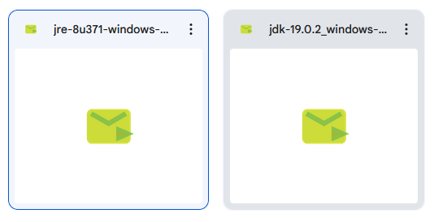
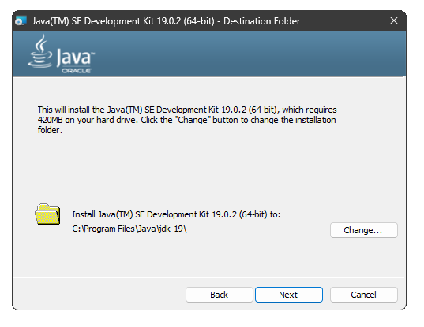
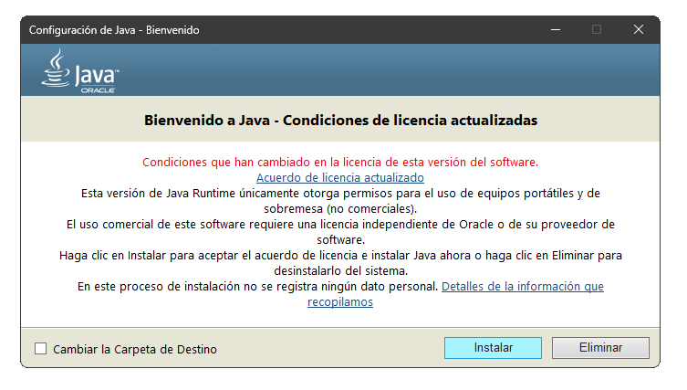
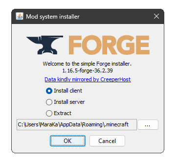
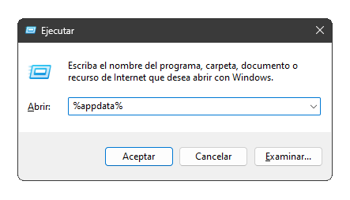

# Guía de instalación del juego y sus mods:

## 1. Instalación del juego:

Para hacer una instalación correcta del juego, primero necesitas comprar Minecraft, debido a que este servidor se encuentra en estado **premium** por lo que si no tienes el juego y quieres comprarlo, aquí te dejo  [un link para que puedas hacerlo.](https://www.minecraft.net/es-es/store/minecraft-deluxe-collection-pc)

Una vez tengas el launcher del juego, que se verá como en la siguiente imagen:

  

Podemos empezar seleccionando la versión del juego que vamos a modificar, para ello deberemos dirigirnos a la pestaña de **Instalaciones** y crear una nueva instalación:

  

Dentro de la configuración de la nueva instalación deberás tener la siguiente información escrita:

  

Y cuando lo hayamos creado, podrás volver a la pestaña principal y iniciar el juego con la versión creada por tí:

  

Ahora lo que simplemente tenemos que hacer, es abrir el juego una sola vez y probar el juego, por tanto, iniciad el juego y seguidamente cread un mundo nuevo:

  

Una vez comprobado que todo está en orden y que el juego funciona correctamente, vamos a instalar los mods.

## 2. Instalación de Java:

Para organizar todo el tema de los archivos, aquí os dejo [un enlace a drive con distintas carpetas](https://drive.google.com/drive/folders/1qgNKS9qWQXf8tUvSjGfNlCQWvLEJWtbP?usp=sharing) que deberían verse tal que así:

  

- Ahora mismo la carpeta que más nos interesa es la de [Java](https://drive.google.com/drive/folders/1qgNKS9qWQXf8tUvSjGfNlCQWvLEJWtbP?usp=sharing), donde, más que nada, necesito asegurar que todo funcione como es debido. Ya que es probable, que aunque el juego haya funcionado en su estado normal, a la hora de insertar los mods, puede fallar y dar muchos dolores de cabeza.
- Dentro de la **Carpeta de Java** Encontramos dos archivos distintos, uno que contiene [Java Cliente](https://www.java.com/en/) y otro que contiene la versión de Java para desarrolladores o [JDK](https://www.oracle.com/java/technologies/javase/jdk19-archive-downloads.html) con la que funciona **Minecraft** de costumbre.

  

- Primero vamos a instalar el **JDK**, por lo tanto, ejecutad el archivo y lo instalais como un programa cualquiera:

  

- Luego, para asegurar, hacemos lo mismo pero con el **Java 8** y lo instalamos:

  

Es importante, a partir de este punto, que puede ser muy recomendado que reinicie el ordenador.

## 3. Instalación de Forge:

Para instalar Forge nos dirigiremos a la carpeta de Drive que pone literalmente [Forge](https://drive.google.com/drive/folders/1qgNKS9qWQXf8tUvSjGfNlCQWvLEJWtbP?usp=sharing) y lo instalaremos también en el pc. (Importante recalcar que hay que ejecutarlo, no ponerlo dentro de ninguna carpeta)

  

Le damos a **OK** y en principio se tendría que instalar en la carpeta donde tenemos minecraft instalado.

## 4. Instalación de los mods del servidor:

En este punto, deberás instalar, de la carpeta de drive, toda la carpeta de mods en algun sítio que te sea fácil ubicar ya sea el escritorio o alguna carpeta vacía... El caso es que ahora, vamos a buscar el directorio donde se ubican todos los archivos del juego. Para ello vamos a hacer lo siguiente:
- Primero pulsa el comando **Win + R** y escribe **%appdata%**:

  

- Luego, accede denttro de la carpeta **.minecraft**:
- Dentro de esa carpeta, en caso de que no exista, deberás crear una carpeta nueva que se va a llamar **mods**:
- Y por ultimo, meteremos todos los mods descargados, dentro de dicha carpeta:
