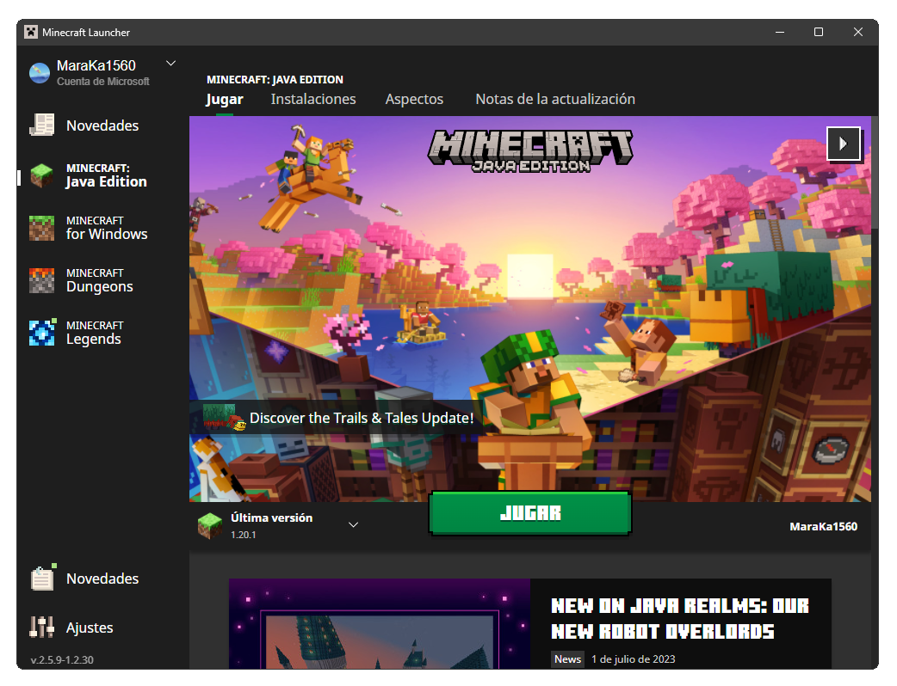
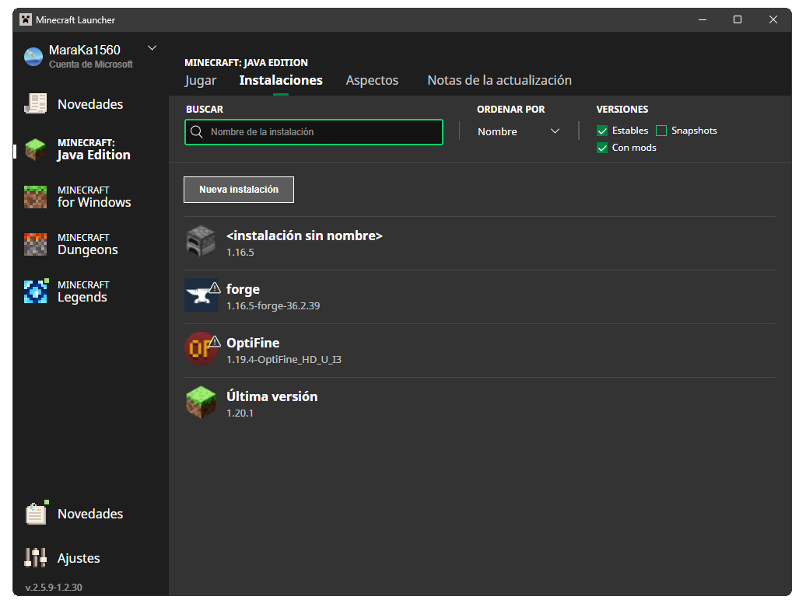
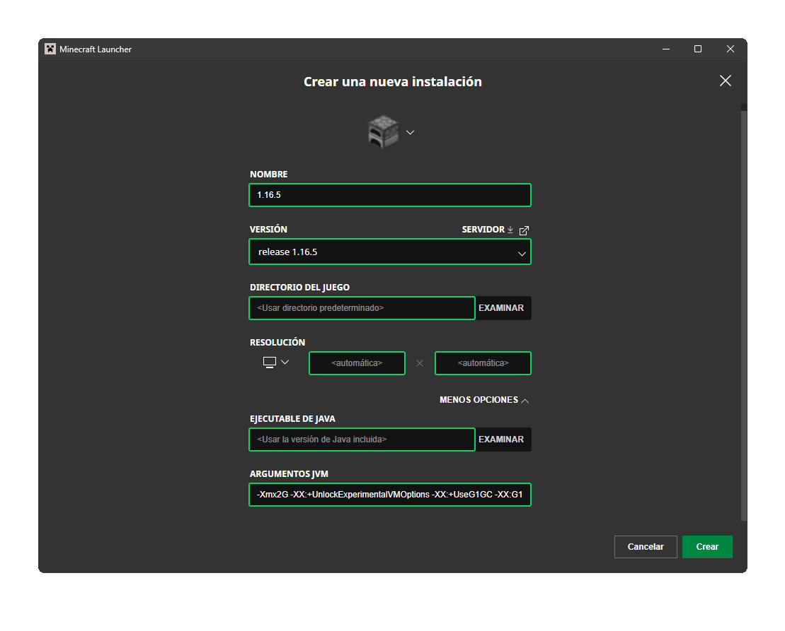
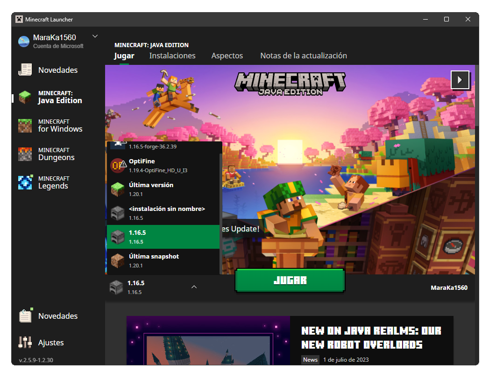
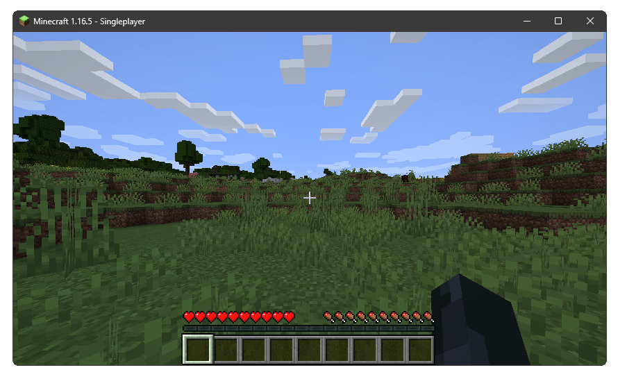
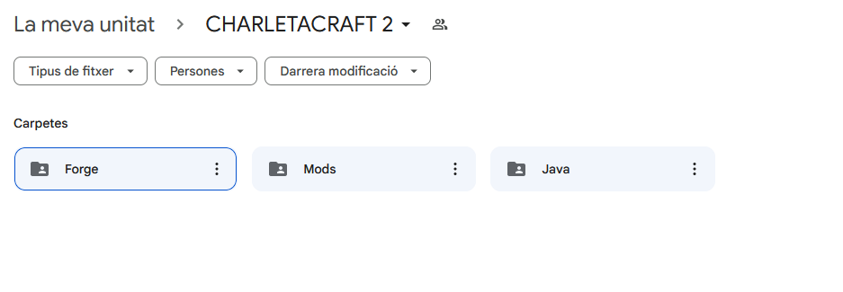

# Guía de instalación del juego y sus mods:

## 1. Instalación del juego:

Para hacer una instalación correcta del juego, primero necesitas comprar Minecraft, debido a que este servidor se encuentra en estado **premium** por lo que si no tienes el juego y quieres comprarlo, aquí te dejo  [un link para que puedas hacerlo.](https://www.minecraft.net/es-es/store/minecraft-deluxe-collection-pc)

Una vez tengas el launcher del juego, que se verá como en la siguiente imagen:

  

Podemos empezar seleccionando la versión del juego que vamos a modificar, para ello deberemos dirigirnos a la pestaña de **Instalaciones** y crear una nueva instalación:

  

Dentro de la configuración de la nueva instalación deberás tener la siguiente información escrita:

  

Y cuando lo hayamos creado, podrás volver a la pestaña principal y iniciar el juego con la versión creada por tí:

  

Ahora lo que simplemente tenemos que hacer, es abrir el juego una sola vez y probar el juego, por tanto, iniciad el juego y seguidamente cread un mundo nuevo:

  

Una vez comprobado que todo está en orden y que el juego funciona correctamente, vamos a instalar los mods.

## 2. Instalación de los mods:

Para organizar todo el tema de los archivos, aquí os dejo [un enlace a drive con distintas carpetas](https://drive.google.com/drive/folders/1qgNKS9qWQXf8tUvSjGfNlCQWvLEJWtbP?usp=sharing) que deberían verse tal que así:

  

