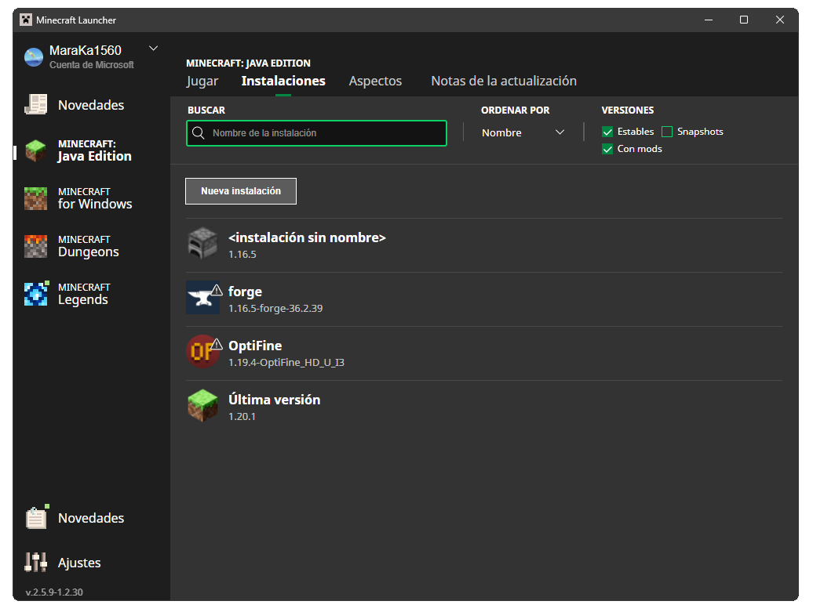

# Mods & game instalation guide:

## 1. Game instalation:

To correctly install the game, first you need to buy Minecraft, since this server a **premium** server so if you have not bought the game but you wish to, [I will leave the link for its purchase.](https://www.minecraft.net/es-es/store/minecraft-deluxe-collection-pc)

Once we have installed the game's launcher, it will look like the following image: 

<p align="center">
  
</p>

We have to start by selecting the game version that we will modify, to do so we choose the **Instalations** (Instalaciones in the image) tab and create a new installation:

<p align="center">
  
</p>

Inside the configuration of the new installation you should see the following information:

<p align="center">
  
</p>

Once we have created it, you can go back to the main tab and start the game with the newly created version:

<p align="center">
  
</p>

Now all that we need to do is, open the game once and try it. So, start the game and create a new world:

<p align="center">
  
</p>

Once we have checked that everything is in order and that the games works correctly, we will instal the mods.

## 2. Java installation:

To better help the file's organitzation, here is [a drive link with different folders](https://drive.google.com/drive/folders/1qgNKS9qWQXf8tUvSjGfNlCQWvLEJWtbP?usp=sharing) that should look like this:


- Right now the important folder is [Java](https://drive.google.com/drive/folders/1qgNKS9qWQXf8tUvSjGfNlCQWvLEJWtbP?usp=sharing), where, mainly, we must confirm that everything works accordingly. Because it is likely that even if the game has worked  in its default setting, once we add the mods, it can break down and give us a bad headache.
- Inside **Carpeta de Java** (Java folder) we find two different files, one includes [Java Cliente](https://www.java.com/en/) and another one that consists of the developer version of Java or [JDK](https://www.oracle.com/java/technologies/javase/jdk19-archive-downloads.html) with which **Minecraft** works.


- To begin with, let us install **JDK**. So, execute the file and install it like any other software:


- Then, just to make sure, we repeat the process with **Java 8** and we install it:


From now on, it can prove beneficial to restart the computer, we strongly recommend it.

## 3. Forge instalation:

To install **Forge** we will go to the Drive folder that is named [Forge](https://drive.google.com/drive/folders/1qgNKS9qWQXf8tUvSjGfNlCQWvLEJWtbP?usp=sharing) and we will install it in the computer. (Friendly reminder that we must execute it, we do not put it inside any folder)


We click **OK** and it should install itself into the folder where **Minecraft** is installed.

## 4. Mods Installation for the server:

By this point, you will have to install, from the Drive folder, the [mods](https://drive.google.com/drive/folders/1qgNKS9qWQXf8tUvSjGfNlCQWvLEJWtbP?usp=sharing) folder somewhere we can easily find it, be it the desktop, an empty folder... Now, we will look for the directory where we will find all the game files. To do so we will do the following:
- First, press the command **Win + R** and type **%appdata%**:


- Then, acces the **.minecraft** folder:


-Inside that folder, we will find a folder named **mods**, if it does not exist, you will have to create a folder named **mods**:


- To put an end to this bullet point, we will place all the mods we have downloaded into said folder:


## 5. Minecraft configuration:

Now that everything is set, we can re-open **Minecraft Launcher**:


But before that, we have to make a few adjustments to **Forge** so that it can launch with more thant 2GB of RAM (the minimum required is 4GB). Consequently, we will go to de **Instalations** (Instalaciones) tab, we click on edit the instalation with **Forge**'s symbol:


- We change the **JVM Arguments** (Argumentos JVM) with the following argument:
```
-Xmx6G -XX:+UnlockExperimentalVMOptions -XX:+UseG1GC -XX:G1NewSizePercent=20 -XX:G1ReservePercent=20 -XX:MaxGCPauseMillis=50 -XX:G1HeapRegionSize=32M
```

---

### And with that the instalation guide is over, enjoy the server :)

If there is any other issue regarding the game or the mods, please make sure to comunicate it in [the discord server.](https://discord.gg/WDTVtWJb)
