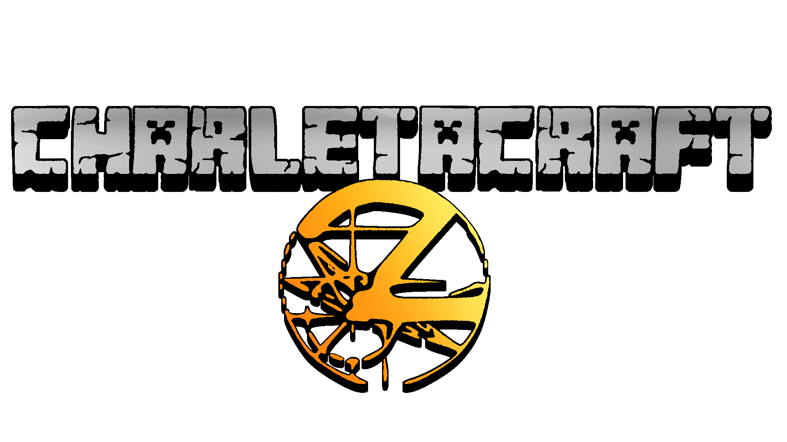

Este servidor está creado para las personas del servidor de discord de . Hecho con cariño para que los jugadores puedan disfrutar durante unas semanas a esta fiesta de diversión y destrucción.

Aunque no es grato tener que añadir normas en el servidor, me veo obligado a crear una lista con mandatos con los que poder seguir una vía de conducta aceptable para que todos puedan respirar sin pensar en que le van a violar la casa por las malas...

## Normas:
- No destruir construcciones ajenas.
- Para crear granjas complejas, se debe pedir permiso al administrador.
- Para qualquier necesidad de la cual se requiera más de un jugador, realizar una petición y un consenso.
- Spam denegado.
- Toxicidad fuera.
- Uno no se puede aprovechar de hacks o bugs para conseguir beneficios en el juego.
- No usar autoclicker.
- Respetar el medioambiente para evitar una destrucción masiva del mundo del servidor.

## Sobre el juego:

Para la convivencia y supervivencia en este servidor, los jugadores tienen permitida la entrada a este las 24 horas durante los 7 días a la semana, si un jugador considera dejar de jugar por algún motivo y sabe que no volverá, el resto de estos podrán aprovecharse de los recursos y de las estructuras creadas por este.

1. Dentro del mundo de **CHARLETACRAFT 2** existen distintas islas con distintos climas y biomas. Durante las horas que irán pasando, la temperatura de ciertos biomas, cambiará y creará un sistema complejo de estaciones que será distinto en las distintas zonas e islas del mapa. En conseqüencia, muchos cultivos dependerán de ciertas estaciones y será preciso manejar con buenas manos todas las oportunidades de comida que se crucen por tu camino.

  

2. El mapa de **CHARLETACRAFT 2** se ubica en un archipielago compuesto por 5 islas con una forma similar a la de una mano. Aquí dentro existen ciertas normas climaticas como se puede apreciar con la parte norte del mapa y la zona ecuatorial, siendo por una parte, una zona gélida y la otra desertica respectivamente. Entre estas dos, podemos encontrar los biomas cambiantes de climas comentados anteriormente. La selección de donde vivirán los jugadores será elegido aleatoriamente dependiendo de la suerte de este. Puede que de primeras, te encuetres encerrado en el Nether sin poder salir hasta que alguien te rescate, o que te toque vivir en un bioma de cerezo, donde las condiciones puedan ser muy refrescantes. (Este cáos de decisiones lo explicaré más adelante)

  

3. En el inicio del servidor, será muy importante mantenerse en la isla donde se generarán todos los jugadores, debido a que se jugará a un juego de separación, los juegadores que quieran convivir conjuntamente, deberán mantenerse juntos delante de las adversidades y los eventos atroces que se vayan presentando. El juego consistirá en un sistema de elección de 3 puertas, en la que deberás elegir la correcta para continuar con las siguientes pruebas donde también habrán otras puertas. Si un jugador pasa por una de las puertas incorrectas, este se teletransportará a un bioma sorpresa y desde ese momento empezará su aventura. (Obviamente no podrá volver al juego a no ser que voluntariamente quiera moverse hasta el spawn original)

  

4. Dentro del servidor se han añadido un total de **93 mods**, con los cuales hemos intentado crear un equilibrio correcto para que todo usuario pueda acceder a este sin muchos problemas:

  

5. Las puertas del Nether estarán abiertas una vez hayan transcurrido 3 días reales. Aunque eso no quiere decir que por desgracia, puedas terminar dentro de este sin poder salir hasta que se habran las puertas que conectan los dos mundos. En cambio, el portal del End, siempre estará abierto en todo momento aunque porsupuesto se se tendrá que respetar y pactar cuando se irá a matar a la dragona del juego y dar así fin a la historia... o eso estaréis pensando.

  

### Historia:

En las tierras leganas de Concha Tumae, existe un pasado oscuro y maligno donde distintas tribus nativas de las distintas islas, sufrieron una guerra de la que nádie tiene casi idea, solo las viejas leyendas y algunos restos de esta, nos dice que tal batalla realmente ocurrió, más se dice que el mal que hacechó en el pasado podría estar resurgiendo de nuevo y probablemente se tenga que luchar de nuevo contra él... Por el alrededor del mapa, encontraréis estos indicios y puede que alguna sorpresa que puede ser tanto grata como desagradable. 

  

