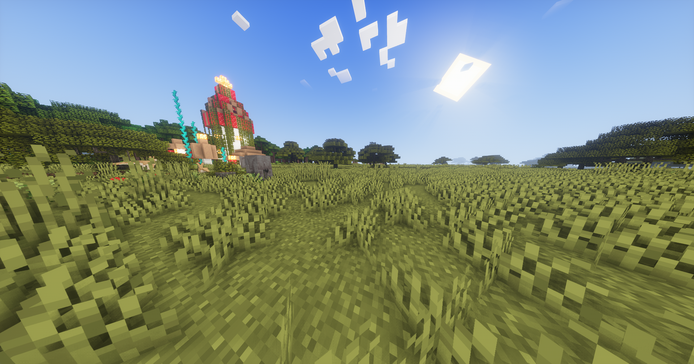
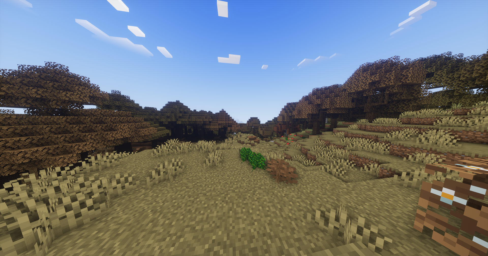
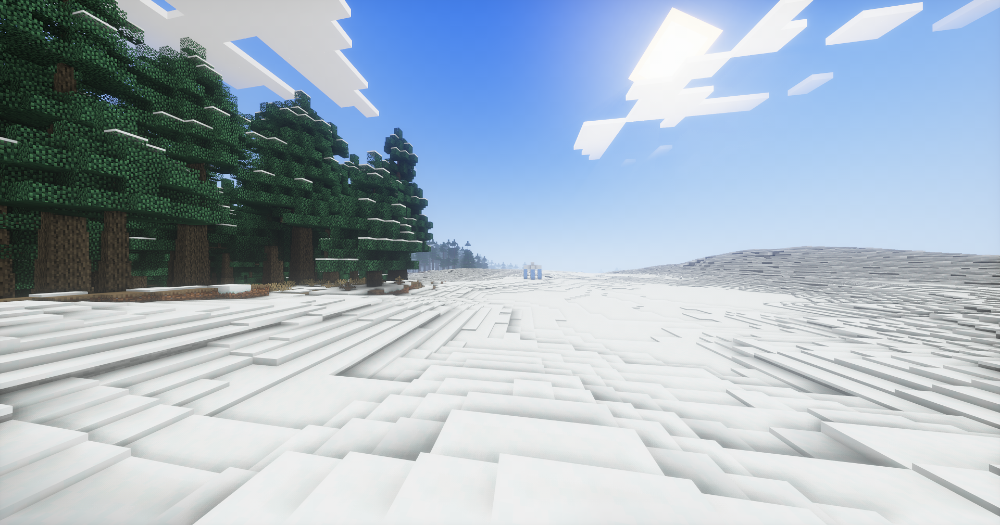
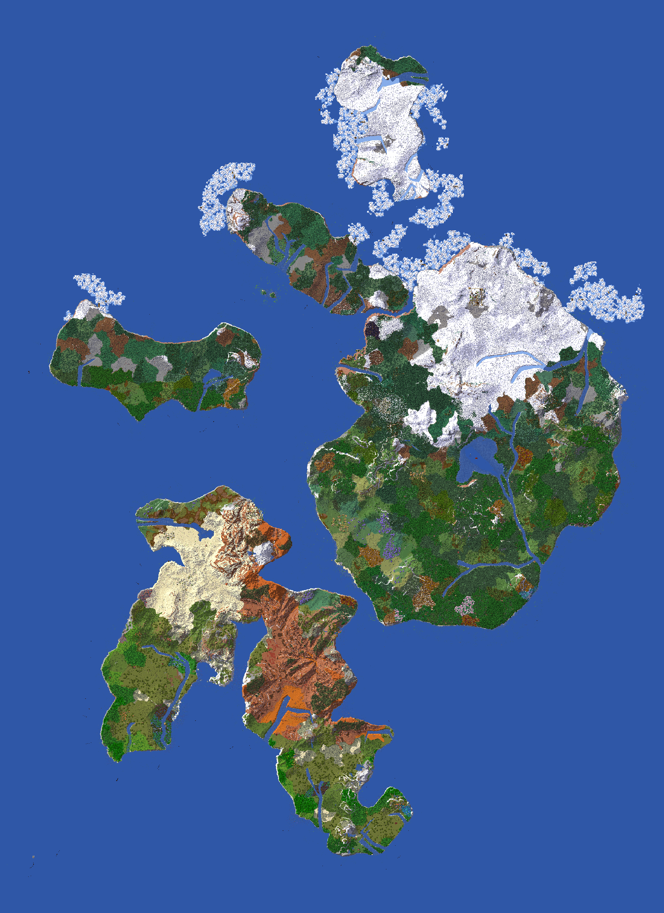

This server was created for the people of . discord server. Made with love so that the players can enjoy this experience of fun and destruction for a few weeks.

Although it isn’t pleasent to add rules to the server, i see myself forced to create a list with the 8 mandates with which the "gay"mers will have an acceptable conduct that will let them breath without thinking that someone is going to destroy their house as johnny Sins does with your mother ass🥵🥵🥵.

## Norms:
- Don’t destroy other players house
- If you want to create complex farms, you must ask permission to the administrator
- For any need that affects more than one player you must make a request and agreement with the other players
- Spam denied
- No toxicity
- You can’t take advantatge of bugs and hacks to have a profit in the game
- Don’t use autoclicker
- Respect the environment to avoid a massive destruction of the world.

## Explicación de convivencia:

For the convenience and the survival in this server, the "gay"mers are allowed to enter the 24 hours of the day and the 7 days of the week, if one player leaves the server the rest of the "gay"mers can take advantatge of the resources and structures created by this player.

1. Inside the world of **CHARLETACRAFT 2** exist different islands with differents climates and biomes. During the hours that will pass, the temperature of some biomes, will change and create a complex system of seasons that will be different in the different zones and islands in the map.For this reason, a lot of crop will depend on expecific seasons and will be better to think well when you will plant your crops.

  

  

  

  

2. The map of CHARLETACRAFT 2 is located in a archipelago composed of 5 islands with the similar shape of a hand.There exist certain climatic norm as you could appreciate in the north of the map and the equatorial zone, being on one hand, a icy zone and the other destertic respectively. Between this two, we can find the changing biomes of the previously mentioned climates. The selection of where will you live, will be randomly decided by the your lucky. At the begging you may find yourself in the Nether unable to leave until someone rescues you, or you maybe end in a cherry blossom biome, where the conditions can be very refreshing.(This chaos of decisions will be explained by me later in the game).

  

