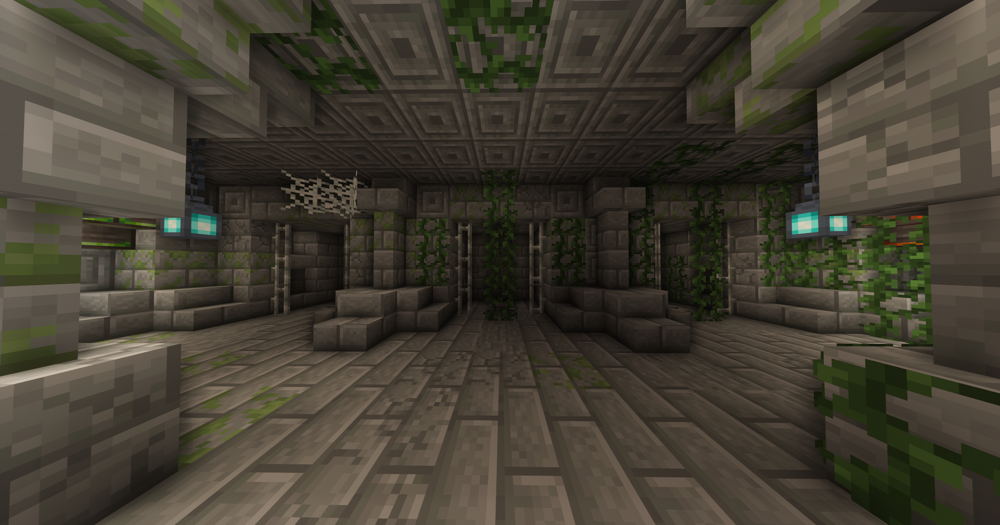

This server was created for the people of . discord server. Made with love so that the players can enjoy this experience of fun and destruction for a few weeks.

Although it is not pleasent to add rules to the server, I see myself forced to create a list with 8 mandates with which the "gay"mers will have an acceptable conduct that will let them breath without thinking that someone is going to destroy their house like Johnny Sins does with your mother's ass🥵🥵🥵.

## Rules:
- Do not destroy other players house
- If you want to create complex farms, you must ask permission to the administrator
- For any need that affects more than one player you must make a request and agreement with the other players
- Spam denied
- No toxicity
- You cannot take advantatge of bugs and hacks to have a profit in the game
- Do not use autoclicker
- Respect the environment to avoid a massive destruction of the world.

## About the game:

For the convenience and the survival in this server, the "gay"mers may join 24 hours a day and the 7 days a week, if one player leaves (permanently) the rest of the "gay"mers can take advantatge of the resources and structures created by this player.

1. Inside the world of **CHARLETACRAFT 2** there exists different islands with different climates and biomes. During the gameplay hours, the temperature of some biomes will change, and create a complex system of seasons which will be different in various zones and islands in the map. For this reason, a lot of crop will depend on specific seasons. So it is crucial to think about when you will plant your crops.

  

  

  

  

2. The map of CHARLETACRAFT 2 is located in an archipelago composed of 5 islands with a shape that resembles that of a hand. There exists certain climatic principles as you can see in the north of the map and the equatorial zone, being on one hand, aa icy zone and the other destertic respectively. Between these two, we can find transitional biomes of the previously mentioned climates. The decision of where you will live, is going to be randomly decided by your luck. At the begging you may find yourself in the Nether unable to leave until someone rescues you, or you may end in a cherry blossom biome, where the conditions can be very refreshing.(This chaos of decisions will be explained by me later in the game).

  

3. When the server launches, it will be key to remain in the island where all the players spawn, due to the fact that the server will follow a separation format, those who wish to live toghether, must remain together to face the adversities and the heinous events that may arise.
The game will be based on a 3 door choice system, in which you must choose the fitting to move onto the next challenges where you will be presented with new doors.
If a player chooses the incorrect door, they will be teleproted into a new environment and from then on their adventure begins.
(Evidently they will not be able to resume the game unless thye voluntarily go back to the original spawn point).

  

4. The server is made up of 93 mods, with which we have attempted to form an appropriate balance so that every player can have access smoothly:

  

  

  

  

